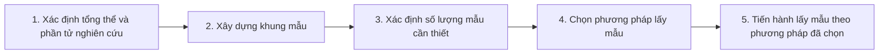

# Elements of the Sampling Problem

## 1. Giới thiệu

Lấy mẫu là một khía cạnh cốt lõi trong nghiên cứu khảo sát, mới mục tiêu chính là đưa ra các suy luận về 1 quằn thể dựa trên một phần nhỏ của quần thể đó gọi là mẫu, thường tập chung vào các chỉ số như trung bình, tổng, tỉ lệ kèm theo 1 giới hạn sai số nhất định. 

## 2. Các thuật ngữ cơ bản

- Phần tử: Là đối tượng đơn lẻ cần khảo sát
- Tổng thể: Là tập hợp tất cả các phần tử mà ta quan tâm
- Khung mẫu: Là danh sách tất cả các phần tử trong tổng thể, từ đó ta sẽ chọn mẫu
- Chọn mẫu: Là quá trình chọn ra 1 hoặc một tập hợp các phần từ từ khung mẫu để tạo thành mẫu khảo sát

Tại sao cần lấy mẫu?

- Tiết kiệm thời gian và chi phí
- Bảo toàn đối tượng nghiên cứu (vì có những nghiên cứu yêu cầu phá hủy đối tượng nghiên cứu, i.e. kiểm thử độ bền của vật liệu)
- Khi tổng thể là vô hạn
- Khi đang kiểm định giả thuyết (ví dụ thử một loại thuốc mới, ta không thể thử trên toàn bộ dân số)

## 3. Quy trình lấy mẫu

## 4. Các phương pháp chọn mẫu chính

