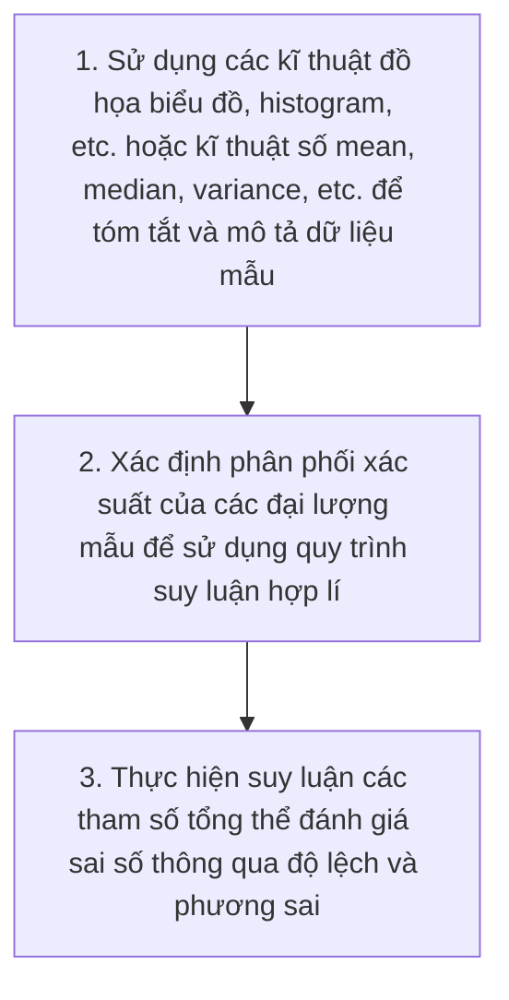

# Some Basic Concepts of Statistics

Mục tiêu chính của thống kê là thực hiện các suy luận về một tổng thể dựa trên thông tin thu thập từ một mẫu dữ liệu. Quá trình này bao gồm 3 bước chính:
1. Tóm tắt thông tin mô tả
2. Xác định phân phối xác suất của các đại lượng mẫu
3. Thực hiện suy luận thông qua ước lượng điểm hoặc khoảng

## 1. Mục tiêu và quy trình thống kê

Mục tiêu của thống kê là đi từ dữ liệu mẫu để đưa ra kết luận có ý nghĩa về 1 nhóm lớn hơn. 

Quy trình thống kê bao gồm:

## 2. Tóm tắt thông tin trong tổng thể và mẫu

Trường hợp `tổng thể vô hạn` sử dụng:
- `Trung bình tổng thể`: μ = E[X]
- `Phương sai tổng thể`: σ² = Var(X)
- `Độ lệch chuẩn tổng thể`: σ = sqrt(σ²)
   Khi đo lường trên mẫu, ta có:
    - `Trung bình mẫu`: ȳ = (1/n) * Σ(yᵢ)
    - `Phương sai mẫu`: s² = (1/(n-1)) * Σ((xᵢ - x̄)²)
    - `Độ lệch chuẩn mẫu`: s = sqrt(s²)

Trường hợp `tổng thể hữu hạn` sử dụng:
- `Ước lượng tổng`: T̂ = (N/n) * Σ(yᵢ)

| Phương pháp lấy mẫu | Đặc điểm | Ưu/Nhược điểm |
|---|---|---|
| Có hoàn lại | Một phần tử có thể được chọn nhiều lần; xác suất chọn không đổi. | Lý thuyết đơn giản nhưng kém hiệu quả thực tế. |
| Không hoàn lại | Một phần tử chỉ được chọn một lần; xác suất chọn thay đổi sau mỗi lần lấy. | Hiệu quả hơn, cho phương sai nhỏ hơn. |

## 3. Phân phối lấy mẫu và định lí giới hạn trung tâm

Đặc tính của Trung bình Mẫu (ȳ) 

Phân phối lấy mẫu của ȳ có xu hướng tập trung quanh giá trị trung bình tổng thể (μ) và có độ biến thiên ít hơn so với các phép đo đơn lẻ.

- Định lý Giới hạn Trung tâm (CLT): Khi cỡ mẫu (n) đủ lớn, phân phối của trung bình mẫu sẽ xấp xỉ phân phối chuẩn, bất kể hình dạng của tổng thể ban đầu.
- Xử lý dữ liệu lệch (Skewed): Đối với tổng thể có độ lệch lớn, các mẫu nhỏ sẽ không tạo ra phân phối chuẩn.
    - Giải pháp 1: Tăng cỡ mẫu (ví dụ: từ n=5 lên n=40).
    - Giải pháp 2: Biến đổi dữ liệu (ví dụ: dùng logarit tự nhiên) để đưa tổng thể về dạng gần chuẩn hơn trước khi lấy mẫu.

Quy tắc đo lường độ phân tán
- Quy tắc phân phối chuẩn: Khoảng 68% giá trị nằm trong 1 độ lệch chuẩn (σ) và 95% nằm trong 2 độ lệch chuẩn của trung bình.
- Định lý Chebyshev: Áp dụng cho mọi loại phân phối. Í nhất (1−1/k²) dữ liệu nằm trong k lần độ lệch chuẩn. Với k=2, ít nhất 75% dữ liệu nằm trong khoảng 2σ. => Ước lượng nhanh: Độ lệch chuẩn thường bằng khoảng 1/4 phạm vi dữ liệu (Range/4).

## 4. Hiệp phương sai và hệ số tương quan

- `Hiệp phương sai (Covariance)`: Đo lường mức độ mà hai biến thay đổi cùng nhau. Công thức: Cov(X, Y) = E[(X - μₓ)(Y - μᵧ)]
- `Hệ số tương quan (Correlation)`: Đo lường mức độ liên hệ tuyến tính giữa hai biến, được chuẩn hóa từ -1 đến 1. Công thức: r = Cov(X, Y) / (σₓ * σᵧ)

Hệ số tương quan Là hiệp phương sai đã được chuẩn hóa bằng cách chia cho tích các độ lệch chuẩn. Luôn nằm trong khoảng [−1,1], không phụ thuộc đơn vị đo, là công cụ tối ưu để so sánh mức độ phụ thuộc.

